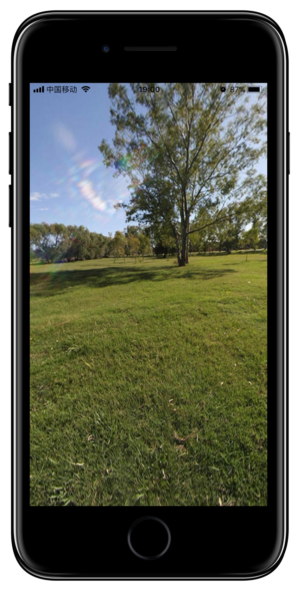

# VRPanoramaKit
一款基于OpenGL渲染的全景图查看器，实现陀螺仪旋转全景图，手动移动和放大全景图。

**使用方法**：

1. 添加OpenGLES.framework框架到项目中

2. 将PanoramaView文件复制到你的目录中

3. 将要显示的图片添加到bundle中(这里可以自己扩展，比如保存到沙盒中)
4. 主要方法

		/**
		 初始化全景控制器
		
		 @param imageName 全景图名字
		 @param type 全景图类型，默认是jpg
		 @return PanoramaController
		 */
		- (instancetype)initWithImageName:(NSString *)imageName type:(NSString *)type;
		
		/**
		*启动全景图
		*/		
		- (void)startPanoramViewMotion;
		
		/**
		* 关闭全景图
		*
		- (void)stopPanoramViewMotion;

**Example in AppDelegate：**
	
	- (BOOL)application:(UIApplication *)application didFinishLaunchingWithOptions:(NSDictionary *)launchOptions {
	    // Override point for customization after application launch.
	    
	    self.window                    = [[UIWindow alloc] initWithFrame:[UIScreen mainScreen].bounds];
	    self.window.backgroundColor    = [UIColor whiteColor];
	    self.window.rootViewController = [[PanoramaController alloc] initWithImageName:@"park" type:@"jpg"];
	
	    [self.window makeKeyAndVisible];
	    
	    return YES;
	}

